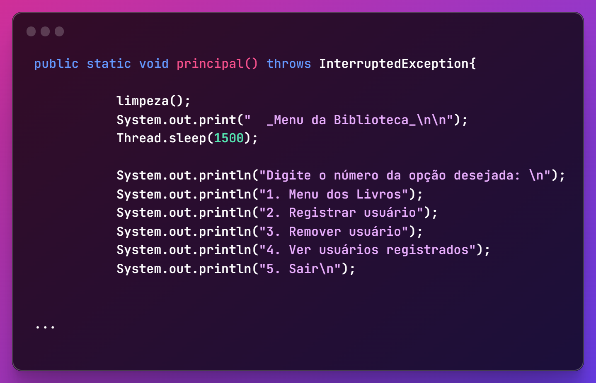

# BookStore Management System


## 📚 Overview

A complete BookStore management system implemented in Java as part of my college coursework. This application demonstrates core object-oriented programming concepts while providing practical functionality for managing a bookstore's inventory and customer interactions.

## ✨ Features

- **Book Management**: Add, remove, and update books in the inventory
- **User Management**: Create and maintain user accounts for customers
- **Borrowing System**: Track book loans and returns
- **Search Functionality**: Find books by title, author, or genre
- **Inventory Reports**: Generate reports on available and borrowed books

## 🎯 Objective

This project was created to demonstrate fundamental object-oriented programming concepts:

- **Encapsulation**: Hiding implementation details while providing controlled access to data
- **Inheritance**: Building specialized classes from more general ones
- **Polymorphism**: Allowing objects to take different forms depending on context
- **Abstraction**: Representing complex systems through simplified interfaces

## 🔧 Installation & Setup

1. Clone this repository
2. Ensure you have Java JDK 8+ installed
3. Navigate to the project directory
4. Compile the Java files:
   ```bash
   javac *.java
   ```
5. Run the application:
   ```bash
   java Main
   ```

## 💻 Usage

The application provides a menu-driven interface to:
- Add new books to the system
- Register new users
- Process book loans
- Handle returns
- Search for books
- Generate reports

## 🏗️ Architecture

The system is structured around several key classes:
- `Book`: Represents a book with properties like title, author, ISBN
- `User`: Stores user information and borrowing history
- `Library`: Manages the book collection and borrowing operations
- `Transaction`: Records borrowing and return events

## 🖼️ Screenshots



## 🔗 Project Structure

The complete project code is available in the [Project](Project) directory.

## 📋 License

This project was created for educational purposes as part of a college assignment.

---

*Created by Bruno Magno as a demonstration of object-oriented programming concepts for my Systems Information course.*
